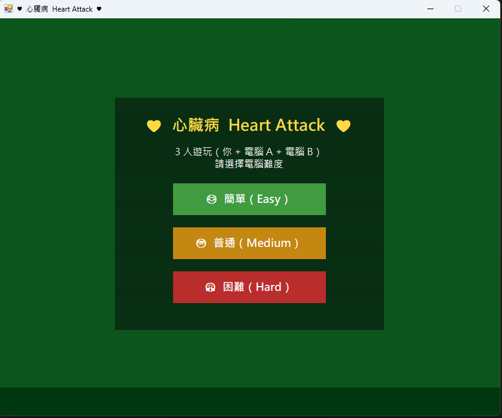
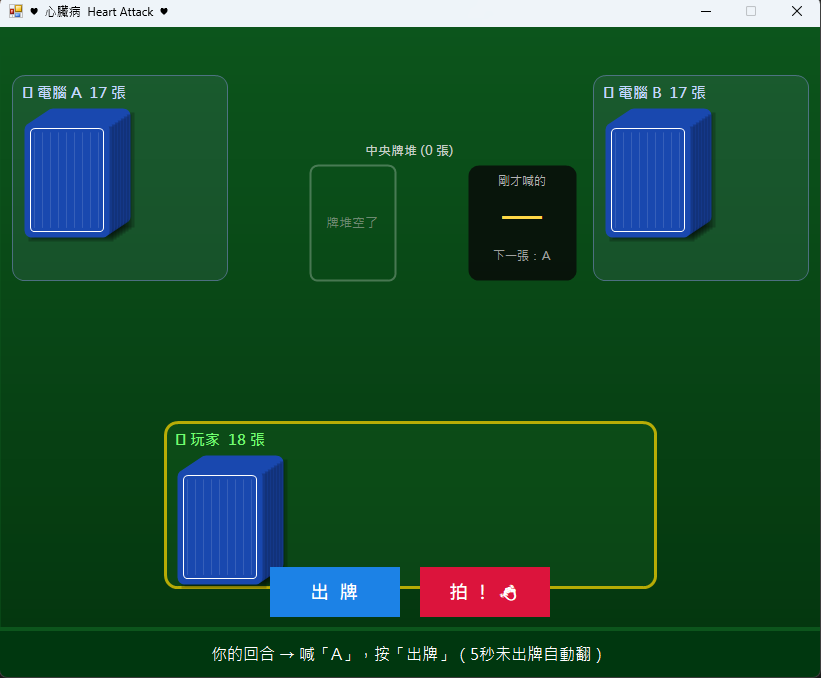

# 心臟病 Heart Attack
視窗程式設計 (II) 作業二：棋牌類遊戲

## 遊戲規則說明

玩家輪流將手牌翻到中央牌堆，同時依序喊出 A → 2 → 3 → ⋯ → K → A（循環）。當翻出的牌點數與當下喊的數字相同，所有人立刻搶拍中央牌堆，最後拍到的人收走全部牌堆。手牌先出完者，需在下一次搶拍中成功拍到（非最後）才算正式退出。最終只剩一位仍持有牌的玩家即為輸家。

## 功能介紹

* 3 人遊玩模式（玩家 + 電腦 A + 電腦 B）
* 三種電腦難度可選：簡單（1.5～3.2 秒）、普通（0.65～1.6 秒）、困難（0.13～0.52 秒），電腦反應時間皆為隨機區間，每局體驗不同
* 每次翻牌自動播放對應數字語音音效（A～K）
* 翻牌後 5 秒內未出牌則自動翻牌
* 遊戲機制：數字相符時全員競速拍牌，最後拍到者收走整疊牌堆
* 誤拍懲罰：非相符時拍牌，牌堆全數歸玩家
* 牌出完後需再拍對一次才能正式退出遊戲
* 玩家率先成功退出時立即顯示獲勝畫面
* 所有人牌皆出完無法繼續時判定平手，自動返回選單
* 牌堆被收走後喊數重置回 A，且由收牌者優先出牌
* 關閉視窗時跳出確認對話框

## 使用方式

1. 啟動程式後選擇電腦難度（簡單 / 普通 / 困難）
2. 輪到自己時按「出牌」按鈕
3. 翻出的牌與喊的數字相符時，立即按「拍！」按鈕
4. 非相符時也可點擊「拍！」，但會被懲罰收走牌堆
5. 牌出完後繼續參與搶拍，成功拍對即獲勝
6. 最後持有牌者為輸家

## 執行畫面

## 開發環境

* C#
* Windows Forms
* Visual Studio

## 音效說明

音效檔案放置於專案根目錄 `Sounds/` 資料夾：

| 檔名 | 用途 |
|------|------|
| `A.wav` ～ `K.wav` | 翻牌時朗讀對應數字 |
| `win.wav` | 玩家獲勝 |
| `lose.wav` | 玩家落敗 |

## 備註

* 電腦兩名的反應時間各自獨立隨機，同一難度下也不會完全同步